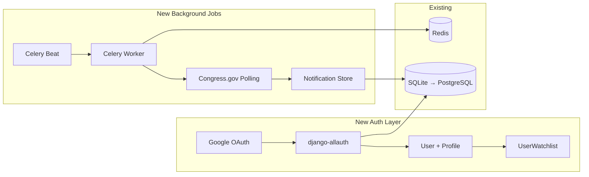

# RepMap — Phased Feature Roadmap

> Based on: personal civic-utility project, long-term virality goal, OAuth auth planned, voting record API ready to wire, expanding to state/local reps.

---

## Phase 1 — "Ship What's Already Built" (1–2 weeks)

Zero new backend APIs. Maximum user-facing impact from code that already exists.

| Feature | Effort | Notes |
|---|---|---|
| **Wire up Voting Record tab** | ~2 hrs | Backend [VotesView](file:///Users/alismacbook/Desktop/Claude%20Project/RepMap/backend/representatives/views.py#L183-L191) exists. New `VotesSection.tsx` calling `/api/representatives/{bioguide_id}/votes/`. Color-code Yes/No/Not Voting badges. |
| **Share / Deep Link** | ~3 hrs | Read `?rep=123` on mount → auto-open panel. Copy-link button in panel header. Update `document.title` to `"Sen. X — RepMap"`. |
| **Name + State search** | ~3 hrs | Client-side fuzzy filter over `allReps` in [SearchBar.tsx](file:///Users/alismacbook/Desktop/Claude%20Project/RepMap/frontend/src/components/Search/SearchBar.tsx). Dropdown with matching results. No backend. |
| **Party composition bar** | ~2 hrs | Collapsible stats ribbon below navbar: `D: 213 · R: 220 · I: 2` for House, similar for Senate. Pure `useMemo` from `allReps`. |

### Architecture Impact: None
Everything is frontend-only or uses existing endpoints.

---

## Phase 2 — "Polish & Mobile" (2–4 weeks)

Make the app production-grade for real users on real devices.

| Feature | Effort | Notes |
|---|---|---|
| **Mobile responsive layout** | ~1 week | Panel → bottom sheet with drag handle. Search → full-width. Pins → touch-optimized tap targets. CSS breakpoints at 768px and 480px. |
| **State-level rep tray** | ~3 days | Clicking a district surface opens a tray listing all House + Senate for that state; pins and tray cards open individual details. |
| **Keyboard navigation** | ~2 days | Arrow keys cycle through visible pins. Escape closes panel. Focus trap in panel. |
| **Compare two reps** | ~4 days | Shift+click or "Compare" button → split panel with side-by-side bio, committees, term progress, vote alignment. |

### Architecture Impact: Minor
- New CSS layer for responsive breakpoints
- New `ComparePanel.tsx` component
- Zustand store additions for compare mode

---

## Phase 3 — "Accounts & Engagement" (1–2 months)

This is where OAuth and personalization unlock the retention loop.

| Feature | Effort | Notes |
|---|---|---|
| **OAuth authentication** | ~1 week | Django: `django-allauth` or `social-auth-app-django`. Google OAuth first (lowest friction for civic apps). React: auth context + protected routes. |
| **Watchlist / My Reps** | ~1 week | `UserWatchlist` model (FK to User + FK to Representative). "Watch" button in panel. Dashboard showing watched reps' recent activity. |
| **Report Card scoring** | ~1 week | Computed from Congress.gov data: attendance %, bipartisanship (cross-party cosponsorships), effectiveness (bills → law). New `ReportCard` component. |
| **Election countdown** | ~3 days | Static JSON or `ElectionDate` model with state primary/general dates. Countdown widget in panel. "Add to Calendar" (.ics export). |
| **Notification system** | ~1 week | Celery + Redis beat task: poll for new votes/legislation for watched reps. In-app notification badge. Optional email digest (post-MVP). |

### Architecture Impact: Significant


> [!IMPORTANT]
> Phase 3 is when you should migrate from SQLite to PostgreSQL. User accounts + watchlists + notifications need proper concurrent writes. The `DATABASE_URL` env var is already wired in [settings.py](file:///Users/alismacbook/Desktop/Claude%20Project/RepMap/backend/repmap/settings.py) for this.

---

## Phase 4 — "The Platform" (3–6 months)

Expand RepMap from a federal-only tool to a full "who represents me at every level" platform.

### 4a. State & Local Representatives

This is the biggest scope expansion. Here's the data landscape:

| Level | Data Source | Coverage | API? | Update Frequency |
|---|---|---|---|---|
| **US Congress** (current) | Congress bulk data + Google Civic | 100% | ✅ | Daily |
| **State Legislators** | [OpenStates API](https://v3.openstates.org/) | 50 states | ✅ Free | Weekly |
| **Governors** | Static dataset / Wikipedia scrape | 50 states | ❌ | Rare |
| **City Council / Mayor** | Google Civic API (partial) | ~60% of cities | ✅ | Varies |
| **School Boards** | Google Civic API (very partial) | ~20% | ✅ | Varies |

**Recommended approach:**
- Start with **State Legislators via OpenStates API** — it's free, well-documented, and gives you 7,000+ state reps with districts, party, committees, and legislation.
- Add a `level` field expansion: `'state_house' | 'state_senate' | 'governor'`
- State legislative districts also come from Census TIGER (SLDL/SLDU shapefiles)

### 4b. Other Platform Features

| Feature | Effort | Notes |
|---|---|---|
| **Embeddable widget** | ~1 week | `/embed?state=CA&district=12` route with stripped-down map + panel. `<iframe>` snippet generator. |
| **Committee network graph** | ~1 week | D3 force-directed graph. Nodes = reps, edges = shared committee membership. Data is already in `committee_assignments`. |
| **Historical redistricting** | ~2 weeks | Census TIGER has CD116 boundaries. Slider to compare old vs. new districts. |
| **PWA + offline mode** | ~3 days | Service worker caches rep data + district GeoJSON for offline browsing. Manifest for "Add to Home Screen". |

---

## Data Architecture for Multi-Level Reps

When you expand to state/local, the current [Representative model](file:///Users/alismacbook/Desktop/Claude%20Project/RepMap/backend/representatives/models.py#L22-L48) needs to grow:

```python
# Current
LEVEL_CHOICES = [('house', 'US House'), ('senate', 'US Senate')]

# Expanded
LEVEL_CHOICES = [
    ('us_house', 'US House'),
    ('us_senate', 'US Senate'),
    ('state_house', 'State House'),
    ('state_senate', 'State Senate'),
    ('governor', 'Governor'),
    ('mayor', 'Mayor'),
    ('city_council', 'City Council'),
]
```

> [!WARNING]
> This is a **breaking migration** on the `level` field. Plan it carefully — rename `'house'` → `'us_house'` and `'senate'` → `'us_senate'` with a data migration before adding new levels. Frontend `Level` type and all zoom-tier logic in [RepMap.tsx](file:///Users/alismacbook/Desktop/Claude%20Project/RepMap/frontend/src/components/Map/RepMap.tsx) will need updating.

---

## Follow-Up Questions

A few more things that will shape implementation:

1. **OAuth provider preference?** You said "prob just OAuth" — I'd recommend **Google OAuth** as the primary (highest trust for a civic app, lowest friction). Would you also want GitHub or Apple Sign-In? Or Google-only to keep it simple?

2. **Hosting target?** I see [railway.toml](file:///Users/alismacbook/Desktop/Claude%20Project/RepMap/backend/railway.toml) configs in both frontend and backend. Are you deploying on Railway? That affects Celery/Redis architecture choices for Phase 3.

3. **OpenStates API key** — it's free but requires registration. Want me to factor that into the env var setup when we get to Phase 4?

4. **Phase 1 execution** — want to start building right now? The Voting Record tab is probably a 2-hour job since the backend is done. I can write the implementation plan and we can ship it today.

---

## Completed Work

### 2026-05-25 — TASK_01: Voting Record Tab (Phase 1)

Shipped the Votes tab. The backend `VotesView` endpoint was already wired up but the Congress.gov `/member/{id}/votes` path turned out to be a dead endpoint (returns 404). Switched the votes data source to the **GovTrack API** (`govtrack.us/api/v2/vote_voter`), which works with no API key. GovTrack person IDs were already stored on each `Representative` in `external_ids['govtrack_id']` from the unitedstates.io sync, so `VotesView` does a single DB lookup to get that ID before calling the service.

Frontend changes: new `VotesSection.tsx` component, `Vote` type added to `types/index.ts`, `getRepVotes` added to `api/representatives.ts`, and `RepresentativePanel.tsx` updated with a fourth tab (`Biography | Legislation | Votes | How to Vote`). Tab pill animation and reset-on-rep-switch behavior work automatically.

Remaining Phase 1 items: Share / Deep Link, Name + State search, Party composition bar.

### 2026-05-25 — TASK_02: Share / Deep Link (Phase 1)

Shipped shareable deep links. Opening `?rep=<bioguide_id>` auto-opens the representative's panel with the map flying to their location. A "Copy link" button (share icon) appears in the panel header to the left of the close button; clicking it copies the current URL and shows "Copied!" for 2 seconds.

Two issues from the original spec were resolved during planning: `bioguide_id` was not in the list-serializer payload (added it to `RepresentativeListSerializer` so `allReps` can be searched by bioguide on mount), and the `replaceState`-only design contradicted the back-button acceptance criterion (adopted a hybrid strategy: `pushState` for the first rep selection from the base URL, `replaceState` when swapping between reps, so browser back returns to `/` without polluting history on every click).

Backend changes: `bioguide_id` added to `RepresentativeListSerializer` (and test updated). Frontend changes: new `utils/clipboard.ts`, `App.tsx` updated with URL write/clear, `document.title` sync, deep-link read-on-mount effect (with ref guard to prevent re-firing), and a `popstate` listener for back/forward navigation. `RepresentativePanel.tsx` gets `ShareIcon`, `copied` state, and the copy button in the header.

Remaining Phase 1 items: Name + State search, Party composition bar.

### 2026-05-25 - TASK_03: Name + State Search (Phase 1)

Shipped frontend-only representative search alongside the existing ZIP workflow. The search bar now accepts representative names, state abbreviations, full state names, and chamber terms such as `TX senate`, while numeric input continues through the ZIP lookup path. Matching results appear in an autocomplete dropdown capped at eight entries with avatar, name, chamber/district, and party indicator.

Frontend changes: new `utils/repSearch.ts` for token-aware matching and ranking, new `NameSearchDropdown.tsx` for accessible result rendering, and `SearchBar.tsx` updated with selection state, keyboard navigation (`ArrowUp`, `ArrowDown`, `Enter`, `Escape`), outside-focus dismissal, combobox attributes, and the new placeholder. `NavBar.tsx` and `App.tsx` now thread representative selection into the existing panel-opening flow, and `styles/components.css` includes dropdown layout and active-result styling.

Remaining Phase 1 item: Party composition bar.

### 2026-05-25 - TASK_04: Party Composition Ribbon (Phase 1)

Shipped the collapsible party composition ribbon below the navbar. Once representative data is loaded, it displays national House and Senate totals for Democrats, Republicans, and Independents, with `other` representatives folded into the Independent bucket. Party totals use the existing light/dark theme color tokens and the ribbon remains out of the layout until `allReps` is populated.

Frontend changes: new `PartyRibbon.tsx` component subscribing directly to the Zustand `allReps` slice, new `PartyRibbon.css` for the compact glass ribbon and collapsed toggle state, and `App.tsx` updated to mount the ribbon between the navbar and map. The collapsed preference persists in `localStorage` under `repmap.partyRibbon.collapsed`.

Verification: `npx tsc --noEmit` and `npm run build` passed. Vite continues to report the existing Mapbox bundle-size warning during production builds.

Phase 1 feature work complete.

### 2026-05-25 - TASK_01: Mobile Responsive Layout (Phase 2)

Shipped the first Phase 2 responsive layout update. At tablet and phone widths (`<= 768px`), the representative panel now presents as a bottom sheet with a visible drag handle, capped viewport height, rounded top corners, and reduced-motion-aware entrance animation. The navbar and search surfaces compact further at phone widths (`<= 480px`) so the primary controls remain usable without crowding.

Frontend changes: `RepresentativePanel.tsx` and `RepresentativePanel.css` add the mobile sheet handle and responsive presentation; `NavBar.css` adds tablet and phone breakpoint behavior; `RepresentativePin.tsx` increases touch hit areas for map pins; `styles/components.css` limits mobile autocomplete height and compacts result items; and `ZipSearchResults.css` extends the full-width bottom overlay layout through tablet widths.

Verification: `npx tsc --noEmit`, `npm run build`, and `git diff --check` passed. Vite continues to report the existing Mapbox bundle-size warning during production builds. Rendered device emulation was not available in this session.

Phase 2 work underway.

### 2026-05-25 - TASK_03: Keyboard Navigation & Accessibility Polish (Phase 2)

Shipped keyboard access for map pin and representative panel workflows. Rendered map pins now use a single tab stop with arrow-key cycling across available markers, while the representative panel opens as a modal dialog with close-button autofocus, a strict focus trap, and focus restoration to the control that opened it.

Frontend changes: `RepMap.tsx` handles arrow-key marker traversal; `RepresentativePin.tsx` accepts the roving tab stop; `RepresentativePanel.tsx` adds dialog semantics and focus management; and `App.tsx` provides stable panel close handling plus page-wide Escape dismissal.

Verification: `npx tsc --noEmit`, `npm run build`, and `git diff --check` passed. Vite continues to report the existing Mapbox bundle-size warning during production builds. The repository does not currently install `eslint`, so its configured lint script cannot execute.

### 2026-05-25 - TASK_04: Compare Two Representatives (Phase 2)

Shipped side-by-side representative comparison. Users can open comparison directly with Shift+click on a second map pin or enter Compare Mode from the representative panel and select a second representative from a pin or search result. The comparison dialog loads both rich profiles independently, shows contact and term information in parallel columns, and calls out shared state and committee assignments.

Frontend changes: `mapStore.ts` and `types/index.ts` track the comparison representative; `RepMap.tsx` and `RepresentativePin.tsx` pass explicit modifier-key selection events; `RepresentativePanel.tsx` provides the compare action and selection banner while allowing background selection; new `ComparePanel.tsx` and `ComparePanel.css` implement the centered accessible dialog; and `App.tsx` coordinates selection, close, and Escape behavior.

Verification: `npx tsc --noEmit`, `npm run build`, and `git diff --check` passed. Vite continues to report the existing Mapbox bundle-size warning during production builds.

### 2026-05-25 - TASK_02: State-Level Representative Tray (Phase 2)

Shipped a state-level delegation drawer for map exploration. Clicking a district surface at any zoom level opens a left-side state tray instead of jumping straight into one House representative; the tray lists both senators and district-sorted House representatives, and selecting a card opens the existing detail flow with its camera animation. Clicking a representative pin remains the direct route to individual details.

Frontend changes: `mapStore.ts` and `types/index.ts` now track the selected state; `RepMap.tsx` routes district-surface clicks to the tray independently of zoom while representative pins retain individual selection; new `StateTray.tsx` and `StateTray.css` provide the themed responsive drawer; and `App.tsx` coordinates the tray with deep links, comparison, ZIP results, and detail selection.

Verification: `npx tsc --noEmit`, `npm run build`, and `git diff --check` passed. Vite continues to report the existing Mapbox bundle-size warning during production builds. Interactive browser verification was not available in this session.

Phase 2 feature work complete.

### 2026-05-25 — TASK_01: Google OAuth Backend (Phase 3)

Shipped session-based Google OAuth via `django-allauth`. The settings-based `SOCIALACCOUNT_PROVIDERS['google']['APP']` approach eliminates the need for a `SocialApp` database row — credentials come from environment variables (`GOOGLE_CLIENT_ID`, `GOOGLE_CLIENT_SECRET`) added to `.env.example`. A `/api/v1/auth/user/` endpoint (AllowAny, GET) exposes the current user object for the frontend and a `/api/v1/auth/logout/` endpoint (IsAuthenticated, POST) ends the session.

Backend changes: `django-allauth` added to `requirements.txt`; `settings.py` updated with `django.contrib.sites`, `allauth.*` and `allauth.socialaccount.providers.google` in INSTALLED_APPS, `SITE_ID = 1`, `AUTHENTICATION_BACKENDS`, `SOCIALACCOUNT_PROVIDERS`, `CORS_ALLOW_CREDENTIALS`, `SESSION_COOKIE_SAMESITE`, and `CSRF_COOKIE_SAMESITE`; `repmap/urls.py` includes `accounts/` for allauth's own views plus the two new API endpoints; migrations run for `sites` and `allauth` tables.

Verification: `python manage.py test` — full suite green.

### 2026-05-25 — TASK_02: Frontend Auth UI (Phase 3)

Shipped the auth context and login/logout UI. The axios client gains `withCredentials: true`, `xsrfCookieName: 'csrftoken'`, and `xsrfHeaderName: 'X-CSRFToken'` so that Django's CSRF enforcement on authenticated POST/DELETE calls is satisfied in-browser. A new `AuthContext` (React context + `useAuth()` hook) fetches `/api/v1/auth/user/` on mount and exposes `isAuthenticated`, `user`, `login` (redirect to Google OAuth), and `logout`.

Frontend changes: `api/client.ts` updated with CSRF and credentials config; new `contexts/AuthContext.tsx`; new `UserMenu.tsx` rendering a sign-in button when logged out and an avatar + sign-out button when authenticated; `main.tsx` wraps `<App/>` in `<AuthProvider>`; `NavBar.tsx` adds a right-section grouping container with the theme toggle and `UserMenu`.

Verification: `npx tsc --noEmit` and `npm run build` clean.

### 2026-05-25 — TASK_03: Watchlist Backend (Phase 3)

Shipped the watchlist data layer. A new `UserWatchlist` model (FK `auth.User`, FK `Representative`, `created_at`, unique-together constraint) allows users to follow specific representatives. Three authenticated endpoints (list, add, remove) return the full representative payload from `RepresentativeListSerializer` so the frontend can render watched-rep cards without a second request.

Backend changes: `UserWatchlist` added to `models.py`; `serializers.py` gains a `WatchlistSerializer`; new `WatchlistView`, `WatchlistAddView`, `WatchlistRemoveView` in `views.py` (all `IsAuthenticated`); URLs registered before the DRF router include; migration `0007_userwatchlist.py` created and applied; watchlist tests added.

Verification: `python manage.py test` — full suite green.

### 2026-05-25 — TASK_04: Frontend Watchlist UI (Phase 3)

Shipped the watchlist UX — a watch button on each representative panel and a "My Reps" dashboard. The `useWatchlist()` hook is lifted to `App.tsx` (inside `AuthProvider`) as the single source of truth; `isWatched`, `toggle`, `entries`, and `refresh` are threaded to both `RepresentativePanel` and `MyRepsDashboard`.

Frontend changes: new `hooks/useWatchlist.ts`; `RepresentativePanel.tsx` gains a `WatchButton` (eye icon, authenticated-only) to the left of the share button; new `MyRepsDashboard.tsx` (card grid of watched reps with unwatch controls); `App.tsx` adds `dashboardOpen` state and passes `onMyRepsClick` to `NavBar`; `NavBar.tsx` shows "My Reps" button when authenticated.

Verification: `npx tsc --noEmit` and `npm run build` clean.

### 2026-05-25 — TASK_05: Report Card Backend (Phase 3)

Shipped the representative accountability scoring endpoint. Three sub-scores are computed from Congress.gov data: attendance (recent votes with a position vs. total), effectiveness (sponsored bills that became law), and bipartisanship (cosponsored legislation with at least one cross-party cosponsor). Results are cached for 6 hours to stay within Congress.gov rate limits.

Backend changes: new `services/report_card.py` with scoring logic reusing `fetch_recent_votes`, `fetch_sponsored_legislation`, and `fetch_cosponsored_legislation`; new `ReportCardView` (AllowAny, 6h cache) using the govtrack-lookup pattern from `VotesView`; `ReportCardThrottle` subclasses `AnonRateThrottle` (not `BaseThrottle`) with a `report_card` scope and rate in `DEFAULT_THROTTLE_RATES`; URL registered before the router include; tests added.

Verification: `python manage.py test` — full suite green.

### 2026-05-25 — TASK_06: Frontend Report Card (Phase 3)

Shipped the report card component displayed at the bottom of the Biography tab. Three circular gauges (attendance, effectiveness, bipartisanship) render with color thresholds (green ≥ 70%, yellow ≥ 40%, red below), a skeleton loading state, and a graceful insufficient-data fallback for representatives with limited Congress.gov coverage.

Frontend changes: `ReportCardData` type added to `types/index.ts`; `getReportCard` added to `api/representatives.ts`; new `ReportCard.tsx` and `ReportCard.css`; `BioTab.tsx` renders `<ReportCard bioguideId={rep.bioguide_id} />` at the bottom when a bioguide ID is present.

Verification: `npx tsc --noEmit` and `npm run build` clean.

### 2026-05-25 — TASK_07: Election Countdown (Phase 3)

Shipped a full-stack election countdown widget. A static `election_data/elections.json` file covers the 2026 federal cycle (primary windows and general election date per state), served by a cached `ElectionDatesView`. The frontend widget computes a live countdown (updating every minute) and renders the relevant upcoming election for the displayed representative's state. A one-click `.ics` export lets users add the date to their calendar.

Backend changes: new `election_data/elections.json`; new `views_elections.py` with `ElectionDatesView` (AllowAny, 1h cache); URL registered in `repmap/urls.py`.

Frontend changes: `ElectionDateInfo` and `ElectionDates` types added; `getElectionDates` added to `api/representatives.ts`; new `ElectionCountdown.tsx` and `ElectionCountdown.css`; embedded at the top of `HowToVoteTab.tsx`.

Verification: `python manage.py test`, `npx tsc --noEmit`, and `npm run build` all clean.

### 2026-05-25 — TASK_08: Notification Backend (Phase 3)

Shipped the Celery-driven notification system. A `@shared_task` named `check_watchlist_activity` iterates every watched representative, fetches their most-recent vote via the GovTrack service, and creates a `Notification` row only if that `vote_key` (bioguide_id + vote_date) hasn't been seen before — preventing duplicate alerts on re-runs. Four authenticated notification endpoints (list, unread-count, mark-one-read, mark-all-read) expose the feed to the frontend.

Backend changes: `celery` and `django-celery-beat` added to `requirements.txt`; `repmap/celery.py` and `repmap/__init__.py` created; `settings.py` gains the Celery block and `django_celery_beat` in INSTALLED_APPS; `Notification` model added to `models.py` with DB indexes; `tasks.py` with module-level `fetch_recent_votes` import (required for `unittest.mock.patch`); `serializers_notifications.py`, `views_notifications.py`, and URL registrations (unread-count and read-all before the per-ID route to prevent slug collisions); migration `0008_notification.py` applied; tests cover API isolation, unread count, mark-read dedup, and synchronous in-process task execution.

Verification: `python manage.py test` (105 tests) — full suite green. Synchronous `check_watchlist_activity()` call confirmed: 1 notification created on first run, 0 on second run (dedup working).

### 2026-05-25 — TASK_09: Frontend Notification Bell (Phase 3)

Shipped the in-app notification bell with activity feed dropdown. A red badge on the bell icon shows the unread count, polled every 60 seconds while the user is authenticated. Clicking the bell loads the full notification feed into a glassmorphism dropdown; each item shows its type icon (checkmark for votes, document for legislation), representative name, relative timestamp, and unread highlight. Individual and bulk mark-as-read work optimistically. The dropdown closes on outside click or Escape.

Frontend changes: new `api/notifications.ts` (NotificationItem type + list/unread-count/read/read-all functions); new `NotificationBell.tsx` with `timeAgo` helper, 60s polling, outside-click and Escape handlers, mark-read and mark-all-read optimistic updates; new `NotificationBell.css` (badge, scrollable dropdown, unread background, mobile full-width fixed position); `NavBar.tsx` updated with `NotificationBell` import rendered between the dark mode toggle and `UserMenu`, authenticated-only.

Verification: `npx tsc --noEmit` and `npm run build` clean (expected Mapbox bundle-size warning only).

Phase 3 feature work complete.

### 2026-05-28 — TASK_01: Level Field Migration (Phase 4)

Renamed the `level` field values from `'house'`/`'senate'` to `'us_house'`/`'us_senate'` across the full stack and expanded `LEVEL_CHOICES` with three new state-level entries (`state_house`, `state_senate`, `governor`). This is the foundation migration that lets Phase 4 add OpenStates legislators and state district GeoJSON without colliding on the generic `house`/`senate` strings.

Backend changes: `LEVEL_CHOICES` expanded to 5 values and `max_length` widened 10 → 20 in `models.py`; `__str__` updated to emit `Sen.` for `us_senate` and `get_level_display()` for state-level entries; new migration `0009_expand_level_choices.py` (generated `AlterField` + injected `RunPython` forwards/backwards) renames all existing rows atomically and is fully reversible; `serializers.py` `get_district_label` updated with `us_senate` and state-level branches; `integrations/zip_lookup.py` DB queries updated (spec omission — would have silently broken ZIP search); `sync_legislators.py` future syncs write `us_house`/`us_senate`; `fixtures/initial_reps.json` all 10 level values rewritten (deploy blocker — `loaddata` runs after `migrate` on fresh installs, so the data migration alone can't fix fixture rows); all four backend test files updated.

Frontend changes: `Level` type in `types/index.ts` expanded to the 5 new values; every `=== 'house'`/`=== 'senate'` comparison flipped across 13 component and utility files (`RepMap.tsx`, `DistrictOverlay.tsx`, `PartyRibbon.tsx`, `RepresentativePin.tsx`, `RepresentativePanel.tsx`, `StateTray.tsx`, `ComparePanel.tsx`, `repSearch.ts`, `App.tsx`, `MyRepsDashboard.tsx`, `NameSearchDropdown.tsx`, `SearchBar.tsx`, `zipFallback.ts`, `ZipSearchResults.tsx`); human-facing search tokens in `repSearch.ts` (`"senate senator"`, `"house representative"`) kept verbatim so text queries for "senate"/"house" continue to match.

Verification: `python manage.py test` — 105 tests, all green. `npx tsc --noEmit` and `npm run build` clean. Sanity grep confirmed zero stale `=== 'house'`/`=== 'senate'` literals in source or fixture JSON.

### 2026-05-28 — TASK_02: OpenStates API Integration (Phase 4)

Created the backend service layer for fetching state legislators from the OpenStates v3 REST API. The spec described a GraphQL integration, but the v3 endpoint is a REST/OpenAPI service — the implementation uses `GET /people` with integer pagination (`page`/`max_page`) rather than a GraphQL query.

Backend changes: new `integrations/openstates.py` with `fetch_state_legislators(state) -> list[dict]`, `OpenStatesUnavailable` exception, 24h cache under `openstates_legislators_{state}`, `org_classification` → `level` mapping (`lower` → `state_house`, `upper` → `state_senate`), party normalization to existing `PARTY_CHOICES`, coordinate fallback to `STATE_CENTROIDS`, and full pagination to handle large legislatures (NH ~400 members). `STATE_CENTROIDS` extracted from `sync_legislators.py` into `constants.py` as a shared single source of truth. `OPENSTATES_API_KEY` added to `settings.py` and `.env.example`. New `tests_openstates.py` with 11 tests covering normalization, chamber detection, multi-page pagination, caching isolation, error wrapping, auth header, and jurisdiction format.

Verification: `python manage.py test` — 116 tests, all green.

### 2026-05-28 — TASK_03: State Legislator Sync Command (Phase 4)

Created `sync_state_legislators` management command that fetches and upserts state legislators from OpenStates into the `Representative` table, following the same upsert-by-external-ID pattern as `sync_legislators.py`.

Backend changes: new `management/commands/sync_state_legislators.py` with `--states` (one or more state codes) and `--purge` (delete retired legislators) flags; upfront `OPENSTATES_API_KEY` guard that raises `CommandError` before the loop; upsert keyed on `external_ids__openstates_id` with a pre-loaded in-memory dict for O(1) lookup; per-state 100ms sleep to stay well under OpenStates rate limits; purge implemented as a Python-loop filter (JSONField `__in` is unreliable on SQLite dev DB); done message reports created/updated/skipped counts. New `tests_sync_state.py` with 7 tests covering create, update, invalid-state error, missing-API-key error, purge removes retired records, no-purge leaves retired records, and done-message format.

Verification: `python manage.py test` — 123 tests, all green. Live verification against OpenStates API requires `OPENSTATES_API_KEY` in `.env` and was not run in this session.

### 2026-05-30 — TASK_04: State District GeoJSON Pipeline (Phase 4)

Created the backend pipeline for serving state legislative district boundaries (SLDL/SLDU) from Census TIGER, mirroring the existing congressional district pattern.

Backend changes: `integrations/census.py` gains three new functions — `get_state_district_data_dir()` for settings-aware path resolution, `load_local_state_legislative_districts(state, chamber)` to serve pre-built files, and `fetch_state_legislative_districts(state, chamber)` which hits TIGER layer 2 (SLDL/lower) or layer 4 (SLDU/upper), simplifies geometry to 0.01°, and injects a `state_abbr` convenience property onto each feature; `settings.py` gains `STATE_DISTRICT_DATA_DIR` env var override; new `management/commands/build_state_district_data.py` command with `--states`, `--overwrite`, and `--chamber` flags writes `{STATE}_lower.json` / `{STATE}_upper.json` per state; new `state_district_data/.gitkeep` directory committed to git; `views.py` adds `StateDistrictView` at `GET /api/v1/districts/state-legislative/?state=CA&chamber=lower|upper` with the same local-file → cache (7 days) → live Census fallback chain as congressional districts; `urls.py` registers the route before the DRF router include. New `tests_state_district.py` with 22 tests covering all acceptance criteria: 400 for missing/invalid state or chamber, local-file serving for both chambers, live fallback enabled/disabled (503 when off), cache hit, Census failure → 500, and command create/skip/overwrite/chamber-filter/failure behaviour.

Verification: `python manage.py test` — 145 tests, all green.

### 2026-05-30 — TASK_05: Frontend State Representatives Display (Phase 4)

Updated the frontend to display state-level representatives alongside federal legislators, with a Federal/State view toggle and zoom-tiered pin disclosure.

Frontend changes: new `ViewLevel = 'federal' | 'state'` type added to `types/index.ts` with `viewLevel` and `setViewLevel` wired into `mapStore.ts`; new `LevelToggle.tsx` segmented control (with `LevelToggle.css`) mounted in `NavBar.tsx` between search and dark mode toggle; `api/representatives.ts` gains `fetchStateLegislativeDistricts(state, chamber)` for the TASK_04 endpoint; new `StateDistrictOverlay.tsx` fetches both lower and upper chamber GeoJSON per selected state, annotates features with party colors from `allReps`, renders them as party-colored Mapbox fill/line layers, and notifies RepMap of interactive layer IDs via `onLayersReady`; `DistrictBoundary.tsx` updated to accept a `level` prop and fetch from the state legislative endpoint (SLDL/SLDU property matching) for `state_house`/`state_senate` reps, falling back to the existing congressional path for federal reps; `RepMap.tsx` reads `viewLevel` from the store and (a) filters `pinsToShow` — federal view: senators at zoom 4–7, all federal at zoom ≥7; state view: state senators at zoom 7–9, all state reps at zoom ≥9; (b) renders `StateDistrictOverlay` when in state view with a selected state code; (c) keeps the national congressional overlay interactive but visually hidden (`dimmed`) in state view so district background clicks still set `selectedStateCode`; (d) updates `handleMouseMove` to use `NAME` from SLDL/SLDU features in state view and suppress national-layer hover tooltips; (e) extends `DistrictBoundary` to cover `state_house`/`state_senate` reps; `RepresentativePin.tsx` adds `levelPrefix` (`State Sen.` / `State Rep.` / `Sen.` / `Rep.`) shown in hover tooltips, and treats state senators as "senior" pins for z-index; `RepresentativePanel.tsx` exposes `STATE_TABS` (Biography + How to Vote only) vs `FEDERAL_TABS` (all four) depending on rep level, updates `getChamberLabel` and `getDistrictLabel` for all five level values, shows the copy-link button for state reps (writing `?rep=<numeric-id>&level=state`); `StateTray.tsx` reads `viewLevel` and switches between `us_senate`/`us_house` and `state_senate`/`state_house` with matching section headings; `PartyRibbon.tsx` reads `viewLevel` and switches the two `ChamberGroup` computations between federal and state chamber levels with updated labels; `App.tsx` tracks `viewLevel` changes (with a ref to skip the initial mount) and clears all selection state + URL on toggle, updates `handleRepSelect` to write `?rep=<bioguide_id>` for federal or `?rep=<id>&level=state` for state reps, and updates both the mount deep-link reader and the `popstate` handler to branch on `level=state`.

Verification: `npx tsc --noEmit` and `npm run build` clean (expected Mapbox bundle-size warning only). Backend `python manage.py test` — 145 tests, all green (no backend changes).
