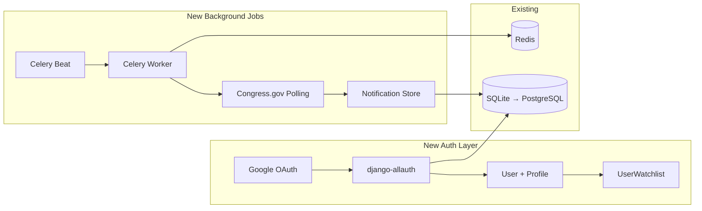

# RepMap — Phased Feature Roadmap

> Based on: personal civic-utility project, long-term virality goal, OAuth auth planned, voting record API ready to wire, expanding to state/local reps.

---

## Phase 1 — "Ship What's Already Built" (1–2 weeks)

Zero new backend APIs. Maximum user-facing impact from code that already exists.

| Feature | Effort | Notes |
|---|---|---|
| **Wire up Voting Record tab** | ~2 hrs | Backend [VotesView](file:///Users/alismacbook/Desktop/Claude%20Project/RepMap/backend/representatives/views.py#L183-L191) exists. New `VotesSection.tsx` calling `/api/representatives/{bioguide_id}/votes/`. Color-code Yes/No/Not Voting badges. |
| **Share / Deep Link** | ~3 hrs | Read `?rep=123` on mount → auto-open panel. Copy-link button in panel header. Update `document.title` to `"Sen. X — RepMap"`. |
| **Name + State search** | ~3 hrs | Client-side fuzzy filter over `allReps` in [SearchBar.tsx](file:///Users/alismacbook/Desktop/Claude%20Project/RepMap/frontend/src/components/Search/SearchBar.tsx). Dropdown with matching results. No backend. |
| **Party composition bar** | ~2 hrs | Collapsible stats ribbon below navbar: `D: 213 · R: 220 · I: 2` for House, similar for Senate. Pure `useMemo` from `allReps`. |

### Architecture Impact: None
Everything is frontend-only or uses existing endpoints.

---

## Phase 2 — "Polish & Mobile" (2–4 weeks)

Make the app production-grade for real users on real devices.

| Feature | Effort | Notes |
|---|---|---|
| **Mobile responsive layout** | ~1 week | Panel → bottom sheet with drag handle. Search → full-width. Pins → touch-optimized tap targets. CSS breakpoints at 768px and 480px. |
| **State-level rep tray** | ~3 days | At zoom 5–7, slide-out tray listing all House + Senate for the visible state. Click → detail panel. |
| **Keyboard navigation** | ~2 days | Arrow keys cycle through visible pins. Escape closes panel. Focus trap in panel. |
| **Compare two reps** | ~4 days | Shift+click or "Compare" button → split panel with side-by-side bio, committees, term progress, vote alignment. |

### Architecture Impact: Minor
- New CSS layer for responsive breakpoints
- New `ComparePanel.tsx` component
- Zustand store additions for compare mode

---

## Phase 3 — "Accounts & Engagement" (1–2 months)

This is where OAuth and personalization unlock the retention loop.

| Feature | Effort | Notes |
|---|---|---|
| **OAuth authentication** | ~1 week | Django: `django-allauth` or `social-auth-app-django`. Google OAuth first (lowest friction for civic apps). React: auth context + protected routes. |
| **Watchlist / My Reps** | ~1 week | `UserWatchlist` model (FK to User + FK to Representative). "Watch" button in panel. Dashboard showing watched reps' recent activity. |
| **Report Card scoring** | ~1 week | Computed from Congress.gov data: attendance %, bipartisanship (cross-party cosponsorships), effectiveness (bills → law). New `ReportCard` component. |
| **Election countdown** | ~3 days | Static JSON or `ElectionDate` model with state primary/general dates. Countdown widget in panel. "Add to Calendar" (.ics export). |
| **Notification system** | ~1 week | Celery + Redis beat task: poll for new votes/legislation for watched reps. In-app notification badge. Optional email digest (post-MVP). |

### Architecture Impact: Significant


> [!IMPORTANT]
> Phase 3 is when you should migrate from SQLite to PostgreSQL. User accounts + watchlists + notifications need proper concurrent writes. The `DATABASE_URL` env var is already wired in [settings.py](file:///Users/alismacbook/Desktop/Claude%20Project/RepMap/backend/repmap/settings.py) for this.

---

## Phase 4 — "The Platform" (3–6 months)

Expand RepMap from a federal-only tool to a full "who represents me at every level" platform.

### 4a. State & Local Representatives

This is the biggest scope expansion. Here's the data landscape:

| Level | Data Source | Coverage | API? | Update Frequency |
|---|---|---|---|---|
| **US Congress** (current) | Congress bulk data + Google Civic | 100% | ✅ | Daily |
| **State Legislators** | [OpenStates API](https://v3.openstates.org/) | 50 states | ✅ Free | Weekly |
| **Governors** | Static dataset / Wikipedia scrape | 50 states | ❌ | Rare |
| **City Council / Mayor** | Google Civic API (partial) | ~60% of cities | ✅ | Varies |
| **School Boards** | Google Civic API (very partial) | ~20% | ✅ | Varies |

**Recommended approach:**
- Start with **State Legislators via OpenStates API** — it's free, well-documented, and gives you 7,000+ state reps with districts, party, committees, and legislation.
- Add a `level` field expansion: `'state_house' | 'state_senate' | 'governor'`
- State legislative districts also come from Census TIGER (SLDL/SLDU shapefiles)

### 4b. Other Platform Features

| Feature | Effort | Notes |
|---|---|---|
| **Embeddable widget** | ~1 week | `/embed?state=CA&district=12` route with stripped-down map + panel. `<iframe>` snippet generator. |
| **Committee network graph** | ~1 week | D3 force-directed graph. Nodes = reps, edges = shared committee membership. Data is already in `committee_assignments`. |
| **Historical redistricting** | ~2 weeks | Census TIGER has CD116 boundaries. Slider to compare old vs. new districts. |
| **PWA + offline mode** | ~3 days | Service worker caches rep data + district GeoJSON for offline browsing. Manifest for "Add to Home Screen". |

---

## Data Architecture for Multi-Level Reps

When you expand to state/local, the current [Representative model](file:///Users/alismacbook/Desktop/Claude%20Project/RepMap/backend/representatives/models.py#L22-L48) needs to grow:

```python
# Current
LEVEL_CHOICES = [('house', 'US House'), ('senate', 'US Senate')]

# Expanded
LEVEL_CHOICES = [
    ('us_house', 'US House'),
    ('us_senate', 'US Senate'),
    ('state_house', 'State House'),
    ('state_senate', 'State Senate'),
    ('governor', 'Governor'),
    ('mayor', 'Mayor'),
    ('city_council', 'City Council'),
]
```

> [!WARNING]
> This is a **breaking migration** on the `level` field. Plan it carefully — rename `'house'` → `'us_house'` and `'senate'` → `'us_senate'` with a data migration before adding new levels. Frontend `Level` type and all zoom-tier logic in [RepMap.tsx](file:///Users/alismacbook/Desktop/Claude%20Project/RepMap/frontend/src/components/Map/RepMap.tsx) will need updating.

---

## Follow-Up Questions

A few more things that will shape implementation:

1. **OAuth provider preference?** You said "prob just OAuth" — I'd recommend **Google OAuth** as the primary (highest trust for a civic app, lowest friction). Would you also want GitHub or Apple Sign-In? Or Google-only to keep it simple?

2. **Hosting target?** I see [railway.toml](file:///Users/alismacbook/Desktop/Claude%20Project/RepMap/backend/railway.toml) configs in both frontend and backend. Are you deploying on Railway? That affects Celery/Redis architecture choices for Phase 3.

3. **OpenStates API key** — it's free but requires registration. Want me to factor that into the env var setup when we get to Phase 4?

4. **Phase 1 execution** — want to start building right now? The Voting Record tab is probably a 2-hour job since the backend is done. I can write the implementation plan and we can ship it today.

---

## Completed Work

### 2026-05-25 — TASK_01: Voting Record Tab (Phase 1)

Shipped the Votes tab. The backend `VotesView` endpoint was already wired up but the Congress.gov `/member/{id}/votes` path turned out to be a dead endpoint (returns 404). Switched the votes data source to the **GovTrack API** (`govtrack.us/api/v2/vote_voter`), which works with no API key. GovTrack person IDs were already stored on each `Representative` in `external_ids['govtrack_id']` from the unitedstates.io sync, so `VotesView` does a single DB lookup to get that ID before calling the service.

Frontend changes: new `VotesSection.tsx` component, `Vote` type added to `types/index.ts`, `getRepVotes` added to `api/representatives.ts`, and `RepresentativePanel.tsx` updated with a fourth tab (`Biography | Legislation | Votes | How to Vote`). Tab pill animation and reset-on-rep-switch behavior work automatically.

Remaining Phase 1 items: Share / Deep Link, Name + State search, Party composition bar.

### 2026-05-25 — TASK_02: Share / Deep Link (Phase 1)

Shipped shareable deep links. Opening `?rep=<bioguide_id>` auto-opens the representative's panel with the map flying to their location. A "Copy link" button (share icon) appears in the panel header to the left of the close button; clicking it copies the current URL and shows "Copied!" for 2 seconds.

Two issues from the original spec were resolved during planning: `bioguide_id` was not in the list-serializer payload (added it to `RepresentativeListSerializer` so `allReps` can be searched by bioguide on mount), and the `replaceState`-only design contradicted the back-button acceptance criterion (adopted a hybrid strategy: `pushState` for the first rep selection from the base URL, `replaceState` when swapping between reps, so browser back returns to `/` without polluting history on every click).

Backend changes: `bioguide_id` added to `RepresentativeListSerializer` (and test updated). Frontend changes: new `utils/clipboard.ts`, `App.tsx` updated with URL write/clear, `document.title` sync, deep-link read-on-mount effect (with ref guard to prevent re-firing), and a `popstate` listener for back/forward navigation. `RepresentativePanel.tsx` gets `ShareIcon`, `copied` state, and the copy button in the header.

Remaining Phase 1 items: Name + State search, Party composition bar.

### 2026-05-25 - TASK_03: Name + State Search (Phase 1)

Shipped frontend-only representative search alongside the existing ZIP workflow. The search bar now accepts representative names, state abbreviations, full state names, and chamber terms such as `TX senate`, while numeric input continues through the ZIP lookup path. Matching results appear in an autocomplete dropdown capped at eight entries with avatar, name, chamber/district, and party indicator.

Frontend changes: new `utils/repSearch.ts` for token-aware matching and ranking, new `NameSearchDropdown.tsx` for accessible result rendering, and `SearchBar.tsx` updated with selection state, keyboard navigation (`ArrowUp`, `ArrowDown`, `Enter`, `Escape`), outside-focus dismissal, combobox attributes, and the new placeholder. `NavBar.tsx` and `App.tsx` now thread representative selection into the existing panel-opening flow, and `styles/components.css` includes dropdown layout and active-result styling.

Remaining Phase 1 item: Party composition bar.

### 2026-05-25 - TASK_04: Party Composition Ribbon (Phase 1)

Shipped the collapsible party composition ribbon below the navbar. Once representative data is loaded, it displays national House and Senate totals for Democrats, Republicans, and Independents, with `other` representatives folded into the Independent bucket. Party totals use the existing light/dark theme color tokens and the ribbon remains out of the layout until `allReps` is populated.

Frontend changes: new `PartyRibbon.tsx` component subscribing directly to the Zustand `allReps` slice, new `PartyRibbon.css` for the compact glass ribbon and collapsed toggle state, and `App.tsx` updated to mount the ribbon between the navbar and map. The collapsed preference persists in `localStorage` under `repmap.partyRibbon.collapsed`.

Verification: `npx tsc --noEmit` and `npm run build` passed. Vite continues to report the existing Mapbox bundle-size warning during production builds.

Phase 1 feature work complete.

### 2026-05-25 - TASK_01: Mobile Responsive Layout (Phase 2)

Shipped the first Phase 2 responsive layout update. At tablet and phone widths (`<= 768px`), the representative panel now presents as a bottom sheet with a visible drag handle, capped viewport height, rounded top corners, and reduced-motion-aware entrance animation. The navbar and search surfaces compact further at phone widths (`<= 480px`) so the primary controls remain usable without crowding.

Frontend changes: `RepresentativePanel.tsx` and `RepresentativePanel.css` add the mobile sheet handle and responsive presentation; `NavBar.css` adds tablet and phone breakpoint behavior; `RepresentativePin.tsx` increases touch hit areas for map pins; `styles/components.css` limits mobile autocomplete height and compacts result items; and `ZipSearchResults.css` extends the full-width bottom overlay layout through tablet widths.

Verification: `npx tsc --noEmit`, `npm run build`, and `git diff --check` passed. Vite continues to report the existing Mapbox bundle-size warning during production builds. Rendered device emulation was not available in this session.

Phase 2 work underway.
